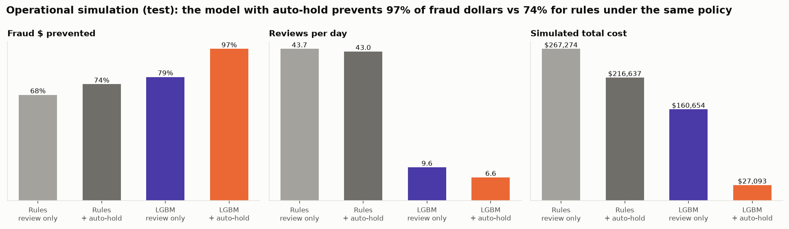
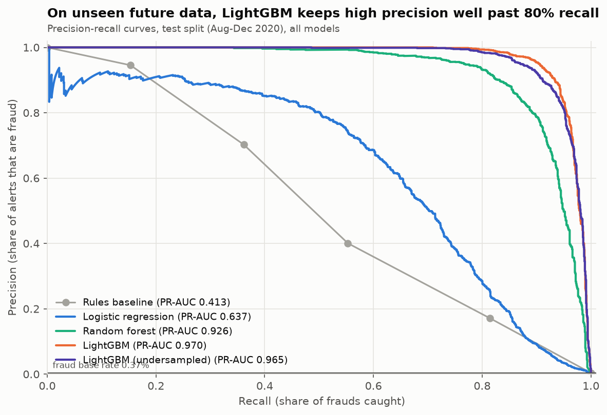
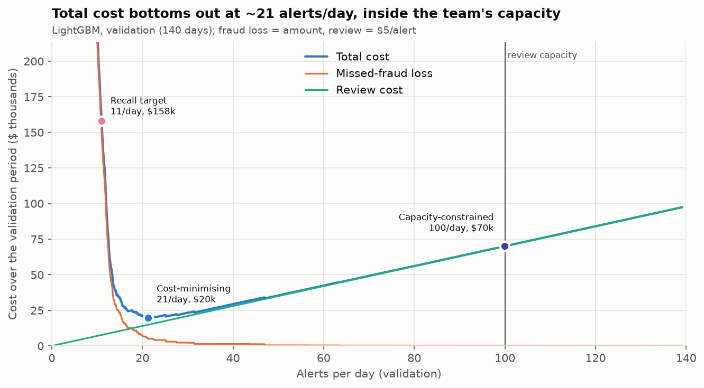
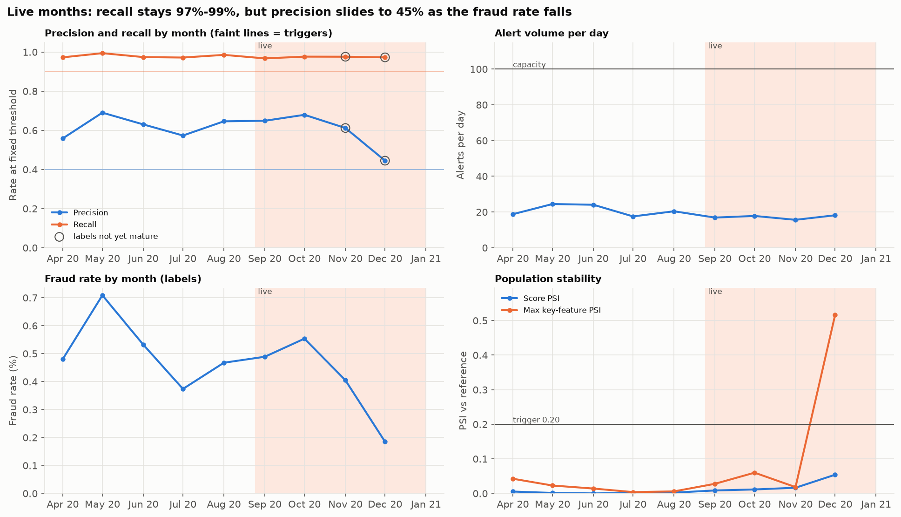

# Fraud Detection and Risk-Threshold Optimisation

**How can a financial institution catch more fraudulent card transactions without generating an unmanageable number of false alerts?**

## Overview

Card fraud is a daily cost for every bank. A bank processes thousands of card payments a day but can only review a small share of them by hand, so it needs a reliable way to decide which payments deserve a closer look.

This project builds that decision system and tests it on 1,852,394 example card payments from a public, computer-generated dataset:
1. **It learns what fraud looked like in the past**, for example large purchases late at night, sudden bursts of spending, or amounts far above what the customer normally spends.
2. **It gives every new payment a risk score.**
3. **It turns the score into an action:** stop the payment and ask the customer, send it to an analyst to check, or let it through. The cut-off points are chosen by weighing the money lost to missed fraud against the cost of analysts' time.
4. **It explains every alert in plain terms**, checks whether different customer groups are treated fairly, and watches for signs that the system has stopped working.

**The result, on payments the system had never seen:** it stopped **96%** of fraud, against **69%** for a set of simple rules. It asked analysts to check about **7** payments a day instead of **43**.

Because the data is computer-generated, real-world results would be lower. This page explains why, and how much lower was measured.

**How to read this page:** this summary and the results table are for everyone. The later sections give the technical detail, and the [glossary](#glossary) at the end explains every technical term in one sentence.

## What the project covers

This project answers that question end to end, the way a fraud-risk team would:
1. **Features built in Structured Query Language (SQL) with DuckDB** that only use information available at authorisation time.
2. **Time-based validation**, with the test set used once.
3. **A transparent rule baseline** compared against logistic regression, random forest and Light Gradient Boosting Machine (LightGBM).
4. **An alert threshold chosen in dollars and analyst workload**, not by accuracy.
5. **Alert explanations with SHapley Additive exPlanations (SHAP)**, error analysis by segment and a fairness review.
6. **Triage bands and a sample case report** for analysts.
7. **Production-style monitoring**: drift, label delay and stress tests.
8. **An operational simulation** of the alert workflow (what auto-hold and post-authorisation review actually prevent), and **three independent reviews** with a findings log.
9. **A Streamlit dashboard.**

> **Read this first.** The dataset is **synthetic** (the Sparkov simulator). Its fraud follows a few scripted patterns, so the headline metrics are much higher than you should expect on real card data. Notebooks 05 and 06 measure how much of the performance depends on those patterns and on workflow assumptions. The value of this project is the **workflow and the decisions**, which transfer directly to real data; the specific numbers do not.

## Headline results (test period: 2020-08-25 to 2020-12-31, 129 days, unseen during development)

These results come from an **operational simulation** (notebook 06), not the idealised cost model:
- **Auto-hold** stops a transaction at authorisation.
- **Review-queue alerts** are worked *after* authorisation, so they can only stop the rest of a fraud burst by blocking the card after the review delay (12 hours).
- **The rules** are a proxy for the current process, built in this project. They get the same auto-hold policy: hold only where validation precision is at least 95%.

| Test period | Rules, review only | Rules + auto-hold (same policy) | **LightGBM + auto-hold + triage bands** |
|---|---|---|---|
| Frauds prevented | 63% | 69% | **96%** |
| Fraud dollars lost | $239,089 | $188,775 | **$22,012** |
| Analyst reviews per day | 43.7 | 43.0 | **6.6** |
| Auto-holds per day | 0.0 | 0.3 | **1.4** |
| Genuine customers wrongly held (period) | 0 | 12 | **61** |
| Simulated total cost | $267,274 | $216,637 | **$27,093** |

- **Cost saving:** against the rules under the same policy, the saving is **$189,544** over 129 days, with a 95% card-bootstrap interval of $149,958 to $231,379. The saving stays positive in every sensitivity scenario (review delay 4–24 hours, recovery 0–50%, friction and review costs).
- **Model-only view (at a fixed threshold):** the model ranks fraud far better. Test Precision-Recall Area Under the Curve (PR-AUC) is **0.970** versus 0.413 for the rules. With the rules' own alert volume, it catches 241 more frauds.
- **Most of the gain comes from auto-hold**, which is possible only because the model's top scores are 95% precise. Reviews after authorisation stop only the tail of a burst.



## Data

| Item | Value |
|---|---|
| Source | Kaggle, [*Credit Card Transactions Fraud Detection Dataset*](https://www.kaggle.com/datasets/kartik2112/fraud-detection) (kartik2112), generated with the Sparkov simulator |
| Licence | Creative Commons Zero (CC0) 1.0 (public domain), as listed in the [Amazon Science fraud-dataset benchmark](https://github.com/amazon-science/fraud-dataset-benchmark) |
| Transactions | 1,852,394 (2019-01-01 to 2020-12-31) |
| Fraud rate | 0.521% (9,651 frauds; about 191 : 1 legitimate to fraud) |
| Customers (cards) / merchants | 999 / 693 across 14 categories |
| Anonymised? | Not anonymised with principal component analysis (PCA). It is **synthetic** with readable fields (amount, category, time, location, age, gender). Names and street addresses are fake and are dropped during cleaning |
| Time order preserved? | Yes: real timestamps. The two Kaggle files are combined and re-split by time |
| Duplicates / missing values | None found (audited in SQL, `sql/01_load_and_clean.sql`) |

**Features used (20 features, including merchant category).** All of them are computed from **earlier transactions only**, in `sql/02_behavioural_features.sql`. They cover:
- **Transaction:** log amount, category, hour, weekday, night flag.
- **Velocity:** transaction count and spend over the prior 1 hour, 24 hours and 7 days.
- **Deviation from the customer's norm:** amount versus the customer's historical, 7-day and same-category average, and an amount z-score.
- **Recency and novelty:** hours since the last transaction, first use of a merchant or category, card history length.
- **Context:** city population, distance from home to merchant.

**Fields a real fraud team would expect, and what this dataset has.** The expected fields come from the [AML Transaction Monitoring Analyst](https://claudefinancelab.com/skill/aml-transaction-monitoring-skill/) skill plus common card-fraud practice:

| Field | Expected by | In Sparkov? | Note |
|---|---|---|---|
| Transaction amount, date/time | Transaction Monitoring Analyst skill; card-fraud practice | Yes | amt, trans_date_trans_time |
| Transaction type / channel (card-present versus card-not-present) | Transaction Monitoring Analyst skill; card-fraud practice | Partial | only implied by category suffix (_pos / _net) |
| Merchant / counterparty identity | Transaction Monitoring Analyst skill | Yes (synthetic) | merchant name; no merchant identifier (ID) |
| Counterparty jurisdiction / country risk | Transaction Monitoring Analyst skill | No | all transactions are United States (US) |
| Merchant category code (MCC) | Card-fraud practice | Partial | 14 broad categories, not merchant category codes (MCCs) |
| Merchant location | Card-fraud practice | Yes (synthetic) | merch_lat / merch_long |
| Card / account identifier | Transaction Monitoring Analyst skill | Yes | cc_num (masked in outputs) |
| Transaction frequency in review period | Transaction Monitoring Analyst skill | Derived | velocity windows in sql/02 |
| Customer baseline (historical behaviour) | Transaction Monitoring Analyst skill | Derived | prior averages, 7-day and category baselines |
| Customer type (individual / business) | Transaction Monitoring Analyst skill | No | all individuals |
| Customer demographics (age, gender, occupation) | Card-fraud practice | Yes | excluded from the model (fairness) |
| Customer home location | Card-fraud practice | Yes (synthetic) | used for home-to-merchant distance |
| Account open date / card tenure | Card-fraud practice | No | only 'first seen in data' |
| politically exposed person (PEP) / high-risk customer flag | Transaction Monitoring Analyst skill | No | anti-money-laundering (AML) field; rarely used for card fraud |
| Prior alert and dispute history | Transaction Monitoring Analyst skill; Alert Triage Tool | No | only reconstructable from this project's own model |
| Device ID, Internet Protocol (IP) address, geolocation of device | Card-fraud practice | No | a key gap for card-not-present fraud |
| Authorisation result (card verification value (CVV), 3-D Secure, address verification service (AVS), point of sale (POS) entry mode) | Card-fraud practice | No |  |
| Credit limit / available balance | Card-fraud practice | No |  |
| Fraud label and label date (chargeback / confirmation date) | Card-fraud practice | Partial | is_fraud only; no label date, so label delay is simulated |
| Customer contact / analyst disposition outcomes | Alert Triage Tool skill | No | needed for feedback and override tracking |

Age and gender are **deliberately excluded** (see Fairness). State is excluded because it nearly identifies individual customers. The full list is in `reports/feature_list.csv`.

## Approach

| Step | What | Why |
|---|---|---|
| 1. SQL prep | Type casting, de-duplication, missing-value handling, backward-only window features | Features must be computable at authorisation time. Tests prove no window looks ahead (`tests/test_leakage.py`) |
| 2. exploratory data analysis (EDA) | Fraud by hour, weekday, category, state, age, gender, amount | 85% of fraud is between 22:00 and 04:00; $250+ transactions are 2.9% of volume but 75% of fraud |
| 3. Time split | 60 / 20 / 20 by date (below) | Production scores the future. A random split leaks transactions from the same fraud burst into test |
| 4. Models | 4 rules, logistic regression, random forest, LightGBM; class weights versus undersampling versus Synthetic Minority Over-sampling Technique (SMOTE) | PR-AUC is primary; confidence intervals come from a card-level bootstrap |
| 5. Thresholds | Cost sweep, capacity and recall-target options, ±50% sensitivity | The threshold is a business decision, so it is made explicit in dollars |
| 6. Explainability | Gain and permutation importance, SHAP (global, dependence, local), partial dependence, segment errors, fairness ablation | Analysts need reasons; risk teams need to know where the model fails |
| 7. Triage | Auto-hold, priority, standard and monitor-only bands; sample case report | Turns scores into queues and actions |
| 8. Monitoring | Monthly and weekly Population Stability Index (PSI) (including the high-score tail), precision/recall, alert volume, missing rate; triggers; stress tests; realism checks | Drift, label delay and adversarial adaptation |
| 9. Operational review | Workflow simulation, staffing by role on peak days, missed-fraud sampling, fairness with confidence intervals; independent review findings log | Tests whether the business case survives how alerts are actually worked |

| Split | Dates | Transactions | Frauds | Fraud rate |
|---|---|---|---|---|
| Train | 2019-01-01 to 2020-04-06 | 1,110,690 | 6,386 | 0.575% |
| Validation | 2020-04-07 to 2020-08-24 | 371,005 | 1,907 | 0.514% |
| Test | 2020-08-25 to 2020-12-31 | 370,699 | 1,358 | 0.366% |

## Model comparison (test period; each model at the threshold that maximised its F1 score on validation)

| Model | PR-AUC [95% confidence interval (CI)] | Receiver Operating Characteristic Area Under the Curve (ROC-AUC) | Precision | Recall | Frauds caught | False alerts | Alerts per day |
|---|---|---|---|---|---|---|---|
| Rules baseline | 0.413 (0.369-0.454) | 0.903 | 17% | 81% | 1,106 | 5,362 | 50.1 |
| Logistic regression | 0.637 (0.589-0.686) | 0.981 | 69% | 59% | 808 | 370 | 9.1 |
| Random forest | 0.926 (0.906-0.941) | 0.995 | 92% | 81% | 1,104 | 95 | 9.3 |
| LightGBM | 0.970 (0.960-0.978) | 0.999 | 95% | 90% | 1,221 | 58 | 9.9 |
| LightGBM (undersampled) | 0.965 (0.954-0.974) | 0.999 | 94% | 89% | 1,204 | 79 | 9.9 |

- LightGBM uses SMOTE (1:10), `num_leaves=15` and 1,504 trees, all chosen on validation.
- The four imbalance treatments were within 0.008 validation PR-AUC of each other. The features matter far more than the resampling.
- Validation PR-AUC was 0.976; test PR-AUC was 0.970.



## Threshold choice (idealised cost model, notebook 03)

This first-pass model assumes that **every alerted fraud is stopped**. The independent review showed that this holds only for auto-hold (see the headline). The idealised model counts every alert:

`Total cost = missed-fraud amount + (TP + FP) x $5 review`, where TP is frauds caught and FP is false alerts.

It reviews every alert, not just the false ones. A variant that counts only false alerts is reported alongside. Thresholds are chosen on validation and applied unchanged to test:

| Option | Threshold | Alerts per day (test) | Precision | Recall | Total cost (test) |
|---|---|---|---|---|---|
| Cost-minimising | 0.0084 | 17.3 | 59% | 97.4% | $21,571 |
| Capacity-constrained (fill 100 per day) | 0.0002 | 88.5 | 12% | 99.4% | $57,335 |
| Recall target (80%) | 0.8889 | 8.3 | 100% | 78.6% | $126,711 |

- **Stable under different cost assumptions:** with fraud loss and review cost each moved ±50%, the optimal volume stays between 17 and 28 alerts per day, and recall between 97% and 99%.
- **Same workload as the rules:** at the rules' own volume of 50 alerts per day, LightGBM catches 241 more frauds (recall 99% versus 81%).



In the operational simulation, the cost-optimal *review* line moves up to 0.129: once auto-hold has blocked the card, reviewing lower scores prevents little extra fraud. The recommendation keeps the triage bands' review line (0.0084) anyway. The analysts are a fixed cost with spare capacity, and every review produces a label for monitoring. Notebook 06 reports both options.

## Assumptions

| Assumption | Value | Rationale |
|---|---|---|
| Fraud loss per missed fraud | Transaction amount x (1 - recovery rate) | Direct loss; the amount is available per transaction, so no flat average is needed |
| Chargeback / recovery rate | 0% | Conservative: assume nothing is recovered. Partial recovery is covered by the -50% loss sensitivity |
| Review cost per alert | $5.00 | ~8 minutes of analyst time at a ~$40/hour fully loaded cost |
| Analysts | 2 | Small fraud-ops team sized to this portfolio (~2,500-2,900 transactions/day) |
| Reviews per analyst per day | 50 | ~8 minutes each over a ~7-hour working day, with time left for escalations |
| Daily review capacity | 100 alerts per day | Analysts x reviews per analyst |
| Recall target | 80% | Example of a policy-driven target (for example a risk-appetite statement) |
| Cost variant used | All alerts (TP + FP) incur the review cost | Analysts review every alert, not only the false ones |

Notebook 03 assumes a caught fraud is stopped before loss. Notebook 06 relaxes this. It adds its own assumptions: a 12 hours review delay, a card block that stops the rest of the fraud episode, a 3-day reissue gap, $1 per auto-hold, $10 friction per wrongly held customer, and correct dispositions.

## Triage (test period)

| Band | Rule (set on validation) | Per day | Hit rate | Share of all fraud |
|---|---|---|---|---|
| Auto-hold | score ≥ 0.244 (≥95% precision) | 10.1 | 95% | 91% |
| Priority review | score ≥ 0.034 (≥80% cumulative precision) | 3.0 | 19% | 5% |
| Standard review | score ≥ 0.0084 (cost-optimal) | 4.2 | 3.3% | 1.3% |
| Monitor only | score ≥ 0.00017 (capacity fill) | 71.2 | 0.3% | 2.0% |

There is a sample analyst case report in [`reports/sample_alert_case.md`](reports/sample_alert_case.md).

## Monitoring (simulated production, Aug to Dec 2020)



- **Stable model, falling fraud rate:** recall stayed between 97% and 99% every live month. Precision fell to 45% in December, because the fraud rate fell during holiday volume; that's a base-rate effect, not model decay.
- **Only one trigger fired:** December's 24-hour velocity features had PSI > 0.2, consistent with holiday volume. Score PSI peaked at 0.05, and a new score-tail PSI (top 10% of scores) stayed low. The "no retrain" conclusion is **provisional**, because December labels are not mature.
- **Stress test, fraudsters move to daytime:** recall fell from 97% to 88% while score PSI did not move. Population drift metrics cannot see new fraud patterns, which is why the plan adds fast partial labels and a random sample of below-threshold reviews.
- **Stress test, feature-store outage:** the missing-input rate rose to 30% and alerts rose from 19 to 28 per day. The daily missing-data trigger catches it immediately.

The full plan (daily, weekly, monthly and quarterly checks, triggers and recalibration protocol) is in [`reports/model_risk_and_monitoring.md`](reports/model_risk_and_monitoring.md).

## Recommendation (summary)

**Recommendation: approve for a 3-month shadow run, not for live decisions yet.**
- **Shadow set-up:** score live traffic with LightGBM, apply the triage bands, and use auto-hold only in the top band (at least 95% precision on validation).
- **Keep the rules running** during the shadow period as the live control.
- **Go-live conditions:** fairness sign-off, replacing SMOTE, and re-validating on the institution's own data. These are the open findings below.

The one-page recommendation for a head of fraud operations is [`reports/business_recommendation.md`](reports/business_recommendation.md). The independent review findings and their status are in [`reports/model_risk_and_monitoring.md`](reports/model_risk_and_monitoring.md#10-independent-review-findings-log).

## Limitations and open issues

- **Synthetic data inflates every metric.** 63% of test fraud matches one scripted pattern (night-time and $250+). On the remaining "off-pattern" fraud, PR-AUC is 0.890 and recall 94%. The amount-SHAP curve shows the model has learned the simulator's fraud-amount bands, which would not transfer.
- **Operational simulation assumptions.** Analysts and customers are assumed to disposition correctly, the review delay is an average, and a card block stops the rest of the episode. The saving interval covers sampling uncertainty, not these assumptions (see the sensitivity table in notebook 06).
- **Open review findings** (details in the findings log):
  - **Fairness.** False-alert rates for older age bands exceed a proposed 1.25x tolerance even though age is not a model input. A proxy analysis and compliance sign-off are needed.
  - **SMOTE creates impossible synthetic records.** Switching to class weights costs about 0.005 PR-AUC and should be done before production.
  - **The validation set is reused** for tuning, early stopping and thresholds, so validation results are optimistic (test is clean).
  - **City population acts as a customer identifier, and card history length acts as a time proxy.** Both should be dropped or capped.
- **Labels are assumed complete and immediate** in training. Hiding 40% of fraud episodes lowers test PR-AUC from 0.965 to 0.919 (undersampled variant, for speed). Real under-reporting is not random.
- **No selection bias from existing rules:** Sparkov labels every transaction. In production, labels exist mainly for what was reviewed or disputed.
- **Missing data sources:** no device, IP, channel, authorisation or merchant-risk data (see the fields table).
- **Demographics:** adding age and gender raises validation PR-AUC by +0.0079. They remain excluded.
- **Logistic regression's best `C` (0.001) is at the edge of the grid searched**, but its validation PR-AUC had flattened (0.616 to 0.628), so it is kept as a baseline only.
- **Scores are not calibrated probabilities** (SMOTE shifts them). Thresholds and bands use ranks set on validation.

## How ClaudeFinanceLab was used

[ClaudeFinanceLab](https://claudefinancelab.com) publishes finance and financial-crime skills as instruction blocks. They were used for **structure, frameworks and review only**: every number, threshold and finding in this repo comes from the project's own code and data.
- The skills are AML-oriented, so they were adapted to card fraud, and the places they don't fit are stated.
- Their text is linked here, not copied, because the site's licence doesn't clearly cover reuse.
- The skills were not installed as Claude skills. Their published instructions were read and applied as frameworks.

| Stage | Resource | How it was used | What changed |
|---|---|---|---|
| Business framing | [AML Transaction Monitoring Alert Triage Tool](https://claudefinancelab.com/skill/aml-transaction-monitoring-alert-triage/), [AML Transaction Monitoring Analyst](https://claudefinancelab.com/skill/aml-transaction-monitoring-skill/) | Workflow stages, roles (first-line analyst (L1) / second-line senior analyst (L2) / supervisor / compliance) and the four disposition outcomes, adapted from AML alerts to card-fraud alerts | New [`reports/fraud_triage_workflow.md`](reports/fraud_triage_workflow.md) |
| Data design | [AML Transaction Monitoring Analyst](https://claudefinancelab.com/skill/aml-transaction-monitoring-skill/) | Its list of transaction and customer fields, compared with the dataset | New "fields" table in *Data* above |
| Rule baseline | [AML Transaction Monitoring Analyst](https://claudefinancelab.com/skill/aml-transaction-monitoring-skill/) | Red-flag categories checked against our rules | **No change.** Our rules already cover deviation from the customer's baseline and velocity. The AML typologies (structuring, layering, high-risk jurisdictions, politically exposed persons (PEPs)) need fields this dataset lacks |
| Model review | [Model Risk Validator](https://claudefinancelab.com/skill/model-risk-validator-skill/) | Conceptual-soundness checklist (for example linear models for non-linear relationships) used in the independent model-risk review | Supports keeping logistic regression as a baseline only |
| Threshold setting | Project's ops-manager review prompt | Independent reviewer assessed whether the data supports the threshold, and what data is missing | See *Limitations*; thresholds remain computed in notebook 03 |
| Case workflow | [AML Transaction Monitoring Alert Triage Tool](https://claudefinancelab.com/skill/aml-transaction-monitoring-alert-triage/), [Financial Crime Investigation Narrative Writer](https://claudefinancelab.com/skill/financial-crime-investigation-narrative-writer/), [SAR Narrative Writer](https://claudefinancelab.com/skill/sar-narrative-writer-skill/) | Referral block, account-baseline comparison, investigation-timeline table for data gaps, disposition checkboxes, sign-off fields, neutral wording | [`reports/sample_alert_case.md`](reports/sample_alert_case.md) restructured (generated by `src/case_report.py`) |
| Monitoring | [Model Risk Governance Validator](https://claudefinancelab.com/skill/model-risk-governance-validator/) | Model tiering, override-rate tracking, change management, validation cadence | Added to [`reports/model_risk_and_monitoring.md`](reports/model_risk_and_monitoring.md) |
| Model-risk review | [Model Risk Validator](https://claudefinancelab.com/skill/model-risk-validator-skill/) + project reviewer prompt | Severity scale (Critical / High / Medium / Low) for the independent review findings | Findings log in the model-risk document |
| Documentation | [Model Risk Governance Validator](https://claudefinancelab.com/skill/model-risk-governance-validator/) | Findings-log and validation-opinion structure | Model-risk document restructured |

## How to reproduce

```bash
git clone https://github.com/pooja003-cloud/fraud-detection-risk-thresholds.git
cd fraud-detection-risk-thresholds
python3.11 -m venv .venv && source .venv/bin/activate
pip install -r requirements.txt
# download fraudTrain.csv and fraudTest.csv from Kaggle into data/raw/ (see data/README.md)
jupyter nbconvert --to notebook --execute --inplace notebooks/0*.ipynb   # 01 to 06, in order (~50 min on 2 cores)
pytest -q                                                               # cost, leakage and drift tests
python -m src.docs                                                      # regenerate README and reports from outputs
streamlit run dashboard/app.py                                          # dashboard (works from committed CSVs)
```

Seeds are fixed (`src/config.py`), and versions are pinned in `requirements.txt` (Python 3.11).

## Repository structure

```
fraud-detection-risk-thresholds/
├── README.md                  # generated by `python -m src.docs`
├── requirements.txt           # pinned versions
├── data/                      # raw/ + processed/ (not committed; see data/README.md)
├── sql/                       # DuckDB: 01 clean, 02 backward-only features, 03 EDA segments
├── notebooks/                 # 01 prep+EDA · 02 models · 03 thresholds+cost · 04 explainability+triage · 05 monitoring · 06 operational review
├── src/                       # config, data, features, rules, models, metrics, costs, operations, explain, triage, case_report, drift, docs
├── dashboard/                 # Streamlit app + the small CSVs it reads
├── reports/
│   ├── figures/               # every chart, with titles that state the finding
│   ├── threshold_cost_table.csv
│   ├── fp_workload_table.csv
│   ├── business_recommendation.md
│   ├── model_risk_and_monitoring.md
│   ├── fraud_triage_workflow.md
│   ├── review_findings.csv        # independent review findings and status
│   ├── sample_alert_case.md       # generated by src/case_report.py
│   └── sample_alert_case_outcome.md   # hindsight label, kept separate on purpose
└── tests/                     # cost function, leakage and drift tests
```

## Glossary

| Term | Meaning |
|---|---|
| Alert | A payment the system flags for action: held, or sent to an analyst. |
| False alert (false positive, FP) | An alert on a genuine payment. It costs analyst time and can annoy the customer. |
| Missed fraud (false negative, FN) | A fraudulent payment the system did not flag. |
| Fraud caught (true positive, TP) | A fraudulent payment the system correctly flagged. |
| Precision | Of all alerts, the share that were really fraud. |
| Recall | Of all fraud, the share the system caught. |
| F1 score | A single number that balances precision and recall (their harmonic mean). |
| Precision-Recall Area Under the Curve (PR-AUC) | How well the model ranks fraud above genuine payments across every possible cut-off, focused on the rare fraud cases. 1.0 is perfect; the fraud rate (about 0.005 here) is what random guessing would score. |
| Receiver Operating Characteristic Area Under the Curve (ROC-AUC) | Another ranking measure. It looks flattering when fraud is rare, so it is reported only as a secondary figure. |
| Threshold (cut-off) | The score above which a payment becomes an alert. |
| Auto-hold | The highest-risk band: the payment is stopped before it goes through, and the customer is asked to confirm it. |
| Triage band | A score range that decides the action: auto-hold, priority review, standard review, or monitor only. |
| Analyst levels (L1 / L2) | First-line (L1) analysts review alerts; second-line (L2) senior analysts confirm fraud and handle unclear cases. |
| Train / validation / test split | Past data used to build the model (train), a later period used to tune it (validation), and a final period used once to check it (test). |
| Time-based split | Splitting the data by date, so the model is always tested on a period after the one it learned from, as in real life. |
| Data leakage | When a model accidentally sees information it would not have at decision time (such as future payments), making results look better than they really are. |
| Class imbalance | When one outcome is very rare. Here only about 1 payment in 190 is fraud. |
| Class weights | Telling the model to treat each fraud case as more important during training, to offset how rare fraud is. |
| Undersampling | Training on only a random part of the genuine payments, so fraud is less rare in the training data. |
| Synthetic Minority Over-sampling Technique (SMOTE) | Creating artificial fraud examples by blending real ones, so fraud is less rare in training. |
| Logistic regression | A simple model that adds up weighted risk factors. Easy to explain, but it cannot capture combinations such as 'large amount AND night'. |
| Random forest | A model that averages many decision trees. |
| Light Gradient Boosting Machine (LightGBM) | A fast model that builds decision trees one after another, each correcting the previous ones' mistakes. The chosen model here. |
| Feature | An input the model uses, such as the amount or the number of payments in the last 24 hours. |
| SHapley Additive exPlanations (SHAP) | A method that shows how much each feature pushed one payment's score up or down. |
| Permutation importance | How much the model gets worse when one feature is shuffled; a measure of how much it relies on that feature. |
| Partial dependence | A chart of how the average score changes as one feature changes. |
| Population Stability Index (PSI) | A number that measures how much a distribution (for example, the scores) has shifted since a reference period. Above 0.2 is usually a warning. |
| Drift | A change over time in the data or in fraud behaviour that can make the model less accurate. |
| Label delay | Confirmed fraud outcomes arrive weeks later (for example, through chargebacks), so recent performance cannot be measured straight away. |
| Chargeback | When a customer disputes a card payment and the money is reversed. A common source of fraud labels. |
| Confidence interval (CI) | A range that shows how uncertain a number is. A 95% interval is built so that it contains the true value 95% of the time. |
| Card-level bootstrap | Estimating uncertainty by repeatedly resampling whole cards, because fraud on the same card is linked. |
| Structured Query Language (SQL) | The standard language for querying data tables. |
| DuckDB | A fast database engine that runs SQL on a laptop. |
| Window function | An SQL tool that computes values over a range of earlier rows, for example a card's spending in the prior 24 hours. |
| Exploratory data analysis (EDA) | Looking at the data with charts and tables before modelling. |
| Sparkov | The simulator that generated this dataset's card payments. |
| Streamlit | A Python tool for building simple interactive web dashboards. |
| Anti-money-laundering (AML) | The field of detecting illegally obtained money moving through the financial system. Related to, but different from, card fraud. |
| Politically exposed person (PEP) | A customer in a prominent public role, who carries a higher money-laundering risk. |
| Suspicious Activity Report (SAR) | A report that financial institutions file with regulators about possible crime. |
| Merchant category code (MCC) | The standard four-digit code for a merchant's type of business. |
| Card verification value (CVV), 3-D Secure, address verification service (AVS) | Security checks made when a card is used online or by phone. |
| Point of sale (POS) | A card payment made in person at a shop terminal. |
| SR 11-7 | United States banking-regulator guidance on managing the risk of using models. |
