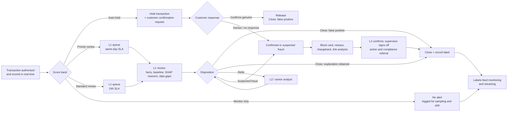

# Fraud alert triage workflow

How a model alert moves from generation to closure: who does what, when, and what gets recorded.
- **Structure:** adapted from ClaudeFinanceLab's [AML Transaction Monitoring Alert Triage Tool](https://claudefinancelab.com/skill/aml-transaction-monitoring-alert-triage/) and [AML Transaction Monitoring Analyst](https://claudefinancelab.com/skill/aml-transaction-monitoring-skill/) skills (AML frameworks, adapted here to card-transaction fraud).
- **Volumes and hit rates:** from this project's test period (notebook 04). Service levels and staffing are proposed design choices, not measured values.

## Flow

## Stages and roles

| # | Stage | Who | What happens | Record |
|---|---|---|---|---|
| 1 | Alert generation | Fraud model (owned by fraud analytics) | Every transaction is scored at authorisation and assigned a band from the cut-offs below | Score, band, model version, threshold version |
| 2 | Auto-hold confirmation | Automated channel, 24/7 (SMS / app push); CX agents for call-backs | Held transaction; the cardholder is asked to confirm through a registered channel. **Time-out:** an unanswered hold stays held and goes to the L1 priority queue at 08:00 | Customer response and time |
| 3 | L1 review | L1 fraud analyst | Six steps: collect alert data → check customer and account baseline → analyse the transaction and recent card activity → match to known fraud patterns → decide disposition → document | Case report ([sample](sample_alert_case.md)) |
| 4 | Disposition | L1 fraud analyst | One of four outcomes (below) | Disposition and rationale |
| 5 | Escalation and confirmation | L2 / senior analyst | Takes unclear or conflicting cases (referrals) and confirms every fraud disposition (four-eyes) | L2 decision |
| 6 | Action and sign-off | Supervisor | Signs off block, reissue and chargeback, and decides whether to refer to compliance for regulatory reporting | Sign-off |
| 7 | Closure and feedback | Fraud analytics | Outcome becomes the training/monitoring label; QA re-reviews a sample of closed cases; a random sample of below-threshold transactions is reviewed each month | Label, QA result |

## Score bands (cut-offs set on validation; volumes from the test period)

| Band | Score cut-off | Alerts/day | Share that are fraud | Share of all fraud | Proposed SLA |
|---|---|---|---|---|---|
| Auto-hold | ≥ 0.244 | 10.1 | 95% | 91% | Automated confirmation, 24/7 |
| Priority review | ≥ 0.034 | 3.0 | 19% | 5% | Same day |
| Standard review | ≥ 0.0084 | 4.2 | 3.3% | 1.3% | 24 hours |
| Monitor only | ≥ 0.00017 | 71.2 | 0.3% | 2.0% | Reviewed with spare capacity (labels / QA) |

The band volumes above count every transaction that scores into a band. In operation, a confirmed fraud blocks the card, so later transactions on it never reach a queue. The notebook-06 simulation of the recommended set-up gives 1.4 auto-holds and 6.6 analyst reviews per day.

## Staffing on peak days (notebook 06; handling times are assumptions)

| Role | Tasks per day (p95 day) | Staff-hours per day (p95 day) |
|---|---|---|
| L1 analyst (reviews) | 13.0 | 1.73 |
| L2 + supervisor (fraud confirmations) | 2.6 | 0.65 |
| Customer contact (auto-holds) | 3.0 | 0.06 |

About **90% of auto-holds occur between 22:00 and 04:00**, which is why confirmation is automated.

## Disposition outcomes (adapted from the Alert Triage Tool's four categories)

| Outcome | When | Follow-up |
|---|---|---|
| Close: false positive | Cardholder confirms the transaction, or the evidence clearly shows it is genuine | Release; label = legitimate |
| Close: explanation obtained | Unusual but explained (travel, large planned purchase) | Document explanation; label = legitimate |
| Refer to L2 / senior analyst | Conflicting or insufficient information | L2 decides within SLA |
| Confirmed / suspected fraud | Cardholder denies, or cannot be reached and the evidence supports fraud | Block, reissue, chargeback; supervisor sign-off; compliance decides on regulatory reporting |

## Controls
- **Four-eyes:** L2 confirms every fraud disposition made by L1. The supervisor signs off account actions (block, reissue) and any compliance referral.
- **QA:** re-review a sample of closed cases each month, and track the *analyst override rate* (dispositions that contradict the model band) as a monitoring metric.
- **Missed-fraud check:** use spare capacity to review the whole monitor-only band (about 6 near-miss frauds a month on test). Fraud far below the threshold can only be found through customer reports and chargebacks, because a random sample there finds almost nothing.
- **Customer-facing wording:** neutral and non-accusatory, e.g. "we noticed an unusual transaction".
